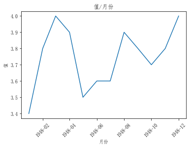
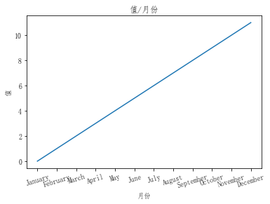
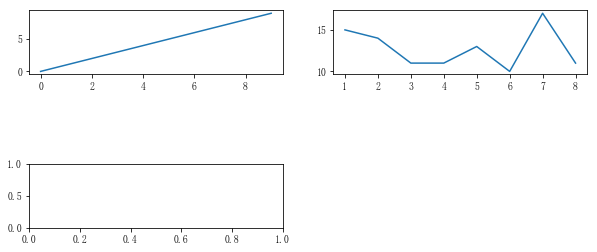
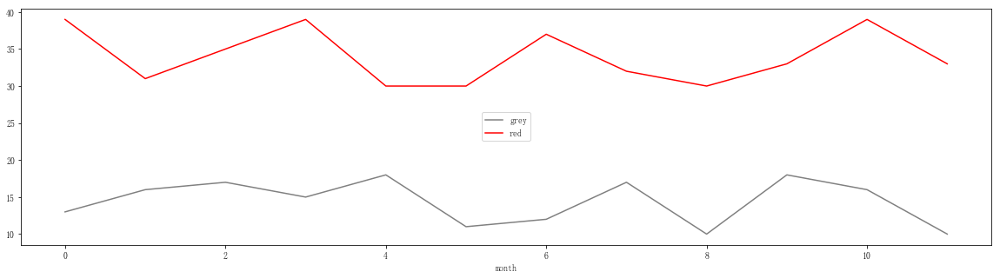
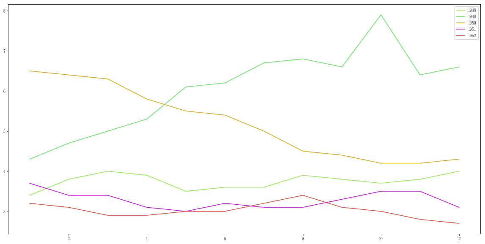
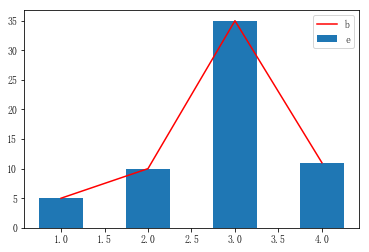
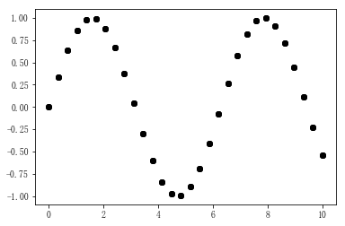
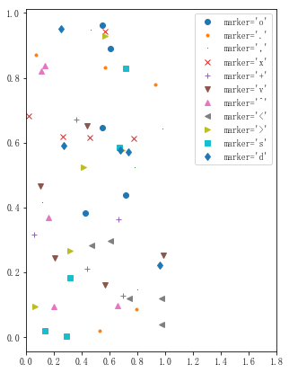
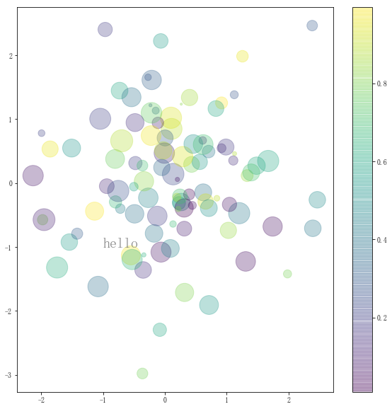
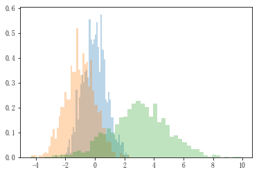

```python
import pandas as pd
data = pd.read_csv("UNRATE.csv")
# 转化为datetime
data["DATE"] = pd.to_datetime(data["DATE"])
print(data.head(12))
```

             DATE  VALUE
    0  1948-01-01    3.4
    1  1948-02-01    3.8
    2  1948-03-01    4.0
    3  1948-04-01    3.9
    4  1948-05-01    3.5
    5  1948-06-01    3.6
    6  1948-07-01    3.6
    7  1948-08-01    3.9
    8  1948-09-01    3.8
    9  1948-10-01    3.7
    10 1948-11-01    3.8
    11 1948-12-01    4.0
    


```python
from matplotlib import pyplot as plt
from pylab import mpl
mpl.rcParams['font.sans-serif'] = ['FangSong'] # 指定默认字体
mpl.rcParams['axes.unicode_minus'] = False # 解决保存图像是负号'-'显示为方块的问题

first_12 = data.head(12)
plt.plot(first_12["DATE"],first_12["VALUE"])
plt.xticks(rotation=45)
plt.xlabel("月份")
plt.ylabel("值")
plt.title("值/月份")
plt.show()
```





```python
import calendar
plt.plot([0,1,2,3,4,5,6,7,8,9,10,11])
plt.xticks(range(12), calendar.month_name[1:13], rotation=17)
plt.xlabel("月份")
plt.ylabel("值")
plt.title("值/月份")
plt.show()
```





```python
import numpy as np
# 指定画布长宽
plt.figure(figsize=(10,4))
# 子图的位置 3x2画布 第一个图
sub1 = plt.subplot(3,2,1)
sub1.plot(np.arange(10))
sub2 = plt.subplot(3,2,2)
sub2.plot([1,2,3,4,5,6,7,8], np.random.randint(10,20,8))
sub2 = plt.subplot(3,2,5)
plt.show()
```





```python
# 在一个图表里用多个图
plt.figure(figsize=(20,5))
plt.plot(np.arange(12), np.random.randint(10,20,12), c=(0.5,0.5,0.5), label="grey")
plt.plot(np.arange(12), np.random.randint(30,40,12), c="red", label = "red")
plt.legend(loc="center")
plt.xlabel("month")
plt.show()
```





```python
plt.figure(figsize=(20,10))
# dt Accessor object for datetimelike properties of the Series values.
data["MONTH"]=data["DATE"].dt.month
import random
for i in range(5):
    sub = data[i*12:(i+1)*12]
    plt.plot(sub['MONTH'],sub['VALUE'],label=str(1948+i), c=(random.random(),random.random(),random.random()))
plt.legend(loc="best")
plt.show()
```





```python
plt.bar([1,2,3,4],[5,10,35,11], 0.5, label="bar")
plt.plot([1,2,3,4],[5,10,35,11], c="red", label="plot")
plt.legend("best")
plt.show()
```





```python
x = np.linspace(0, 10, 30)
y = np.sin(x)
plt.plot(x, y, 'o', color='black')
plt.show()
```





```python
rng = np.random.RandomState(0)
plt.figure(figsize=(5,7))
for marker in ['o', '.', ',', 'x', '+', 'v', '^', '<', '>', 's', 'd']:
    plt.plot(rng.rand(5), rng.rand(5), marker,
    label="marker='{0}'".format(marker))
plt.legend(numpoints=1)
plt.xlim(0, 1.8)
plt.show()
```





```python
plt.figure(figsize=(10,10))
rng = np.random.RandomState(10)
x = rng.randn(100)
y = rng.randn(100)
colors = rng.rand(100)
sizes = 1000 * rng.rand(100)
plt.scatter(x, y, c=colors, s=sizes, alpha=0.3,cmap='viridis')
plt.colorbar(); # 显示颜色条
style = dict(size=20, color='gray')
# x,y坐标 文字和样式
plt.text(-1,-1,"hello", **style)
plt.show()
```





```python
kwargs = dict(histtype='stepfilled', alpha=0.3, normed=True,bins=50)
plt.hist(np.random.normal(0, 0.8, 1000), **kwargs)
plt.hist(np.random.normal(-1, 1, 1000), **kwargs)
plt.hist(np.random.normal(3, 2, 1000), **kwargs)
plt.show()
```




