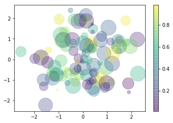
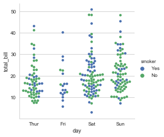

```python
import seaborn as sns
import numpy as np
import matplotlib as mpl
import matplotlib.pyplot as plt
import pandas as pd
%matplotlib inline
```


```python
def draw():
    rng = np.random.RandomState(0)
    x = rng.randn(100)
    y = rng.randn(100)
    colors = rng.rand(100)
    sizes = 1000 * rng.rand(100)
    plt.scatter(x, y, c=colors, s=sizes, alpha=0.3, cmap='viridis')
    plt.colorbar();
```


```python
draw()
```





支持5种style:
darkgrid, whitegrid, dark, white, and ticks


```python
plt.figure(figsize=(20,30))
sns.set()
plt.subplot(4,2,1)
draw()

sns.set_style("darkgrid")
plt.subplot(4,2,2)
plt.title("darkgrid", fontsize=20)
draw()

sns.set_style("whitegrid")
plt.subplot(4,2,3)
plt.title("whitegrid", fontsize=20)
draw()

sns.set_style("dark")
plt.subplot(4,2,4)
plt.title("dark", fontsize=20)
draw()

sns.set_style("white")
plt.subplot(4,2,5)
plt.title("white", fontsize=20)
draw()

sns.set_style("ticks")
plt.subplot(4,2,6)
plt.title("ticks", fontsize=20)
draw()

```


```python
sns.set_style("ticks")
draw()
# 去除右上边框 要设置好之后不然没什么用
sns.despine()
```


# 调色板
color_palette()


```python
currnet_palette = sns.color_palette()
sns.palplot(currnet_palette)
```


## 圆形画板
有6个以上分类要区分时,最简单的方法是在一个圆形颜色空间中画出均匀间隔的颜色  
最常用的方法是使用hls的颜色空间


```python
sns.palplot(sns.color_palette("hls", 10))
```


```python
data = np.random.normal(size=(20,8)) + np.arange(8) / 2
sns.boxplot(data=data, palette=sns.color_palette("hls",8))
```


    <matplotlib.axes._subplots.AxesSubplot at 0x26f154099b0>


```python
sns.palplot(sns.hls_palette(8,l=0.5,s=0.5)) # l 亮度 s饱和度
```


```python
sns.palplot(sns.color_palette("Paired",10)) # 成对颜色 两个的颜色相近
```


## 使用xkcd颜色来命名颜色


```python
plt.plot([0,1],[0,1], sns.xkcd_rgb["medium green"],lw=3)
plt.plot([0,1],[0,2], sns.xkcd_rgb["pale red"],lw=3)
```


    [<matplotlib.lines.Line2D at 0x26f155bfef0>]


## 连续色板
色彩随数据变换


```python
sns.palplot(sns.color_palette("Blues"))
sns.set_style("dark")
```


## cubehelix_palette()调色板
色调线性变换


```python
sns.palplot(sns.color_palette("cubehelix", 8))
```


```python
sns.palplot(sns.cubehelix_palette(8))
```


## light_palette()和dark_palette()
调用定制连续调色板


```python
sns.palplot(sns.light_palette("green"))
```


```python
sns.palplot(sns.dark_palette("gray"))
```


# 单变量分析绘图


```python
np.random.seed(sum(map(ord, "distributions")))
```


```python
x = np.random.normal(size=100)
sns.set_style("whitegrid")
sns.distplot(x, kde=False)
```


    <matplotlib.axes._subplots.AxesSubplot at 0x26f15769710>


```python
sns.distplot(x, bins=20)
```


    <matplotlib.axes._subplots.AxesSubplot at 0x26f15636240>


```python
mean,cov=[0,1],[(1,0.5),(0.5,1)]
data=np.random.multivariate_normal(mean, cov, 200)
df = pd.DataFrame(data, columns=["x","y"])
df
```


<div>
<style>
    .dataframe thead tr:only-child th {
        text-align: right;
    }

    .dataframe thead th {
        text-align: left;
    }

    .dataframe tbody tr th {
        vertical-align: top;
    }
</style>
<table border="1" class="dataframe">
  <thead>
    <tr style="text-align: right;">
      <th></th>
      <th>x</th>
      <th>y</th>
    </tr>
  </thead>
  <tbody>
    <tr>
      <th>0</th>
      <td>-0.995328</td>
      <td>0.721782</td>
    </tr>
    <tr>
      <th>1</th>
      <td>-0.944528</td>
      <td>0.276843</td>
    </tr>
    <tr>
      <th>2</th>
      <td>-1.109385</td>
      <td>2.246853</td>
    </tr>
    <tr>
      <th>3</th>
      <td>0.682844</td>
      <td>0.023013</td>
    </tr>
    <tr>
      <th>4</th>
      <td>-0.417883</td>
      <td>-0.987145</td>
    </tr>
    <tr>
      <th>5</th>
      <td>0.933967</td>
      <td>1.331390</td>
    </tr>
    <tr>
      <th>6</th>
      <td>-1.168953</td>
      <td>0.613115</td>
    </tr>
    <tr>
      <th>7</th>
      <td>0.345953</td>
      <td>0.898707</td>
    </tr>
    <tr>
      <th>8</th>
      <td>-0.466411</td>
      <td>0.960704</td>
    </tr>
    <tr>
      <th>9</th>
      <td>-0.591650</td>
      <td>0.562268</td>
    </tr>
    <tr>
      <th>10</th>
      <td>1.611535</td>
      <td>2.041976</td>
    </tr>
    <tr>
      <th>11</th>
      <td>-0.824081</td>
      <td>0.458673</td>
    </tr>
    <tr>
      <th>12</th>
      <td>1.089911</td>
      <td>0.925933</td>
    </tr>
    <tr>
      <th>13</th>
      <td>-0.118518</td>
      <td>0.618046</td>
    </tr>
    <tr>
      <th>14</th>
      <td>2.179897</td>
      <td>1.422441</td>
    </tr>
    <tr>
      <th>15</th>
      <td>1.548905</td>
      <td>1.815064</td>
    </tr>
    <tr>
      <th>16</th>
      <td>-0.620819</td>
      <td>1.718632</td>
    </tr>
    <tr>
      <th>17</th>
      <td>-2.047915</td>
      <td>-0.522178</td>
    </tr>
    <tr>
      <th>18</th>
      <td>0.178363</td>
      <td>0.825063</td>
    </tr>
    <tr>
      <th>19</th>
      <td>0.645984</td>
      <td>0.894560</td>
    </tr>
    <tr>
      <th>20</th>
      <td>-0.414228</td>
      <td>0.409704</td>
    </tr>
    <tr>
      <th>21</th>
      <td>0.570066</td>
      <td>2.027905</td>
    </tr>
    <tr>
      <th>22</th>
      <td>0.012324</td>
      <td>0.178793</td>
    </tr>
    <tr>
      <th>23</th>
      <td>0.604576</td>
      <td>-0.008147</td>
    </tr>
    <tr>
      <th>24</th>
      <td>0.188567</td>
      <td>0.554129</td>
    </tr>
    <tr>
      <th>25</th>
      <td>0.374312</td>
      <td>1.090579</td>
    </tr>
    <tr>
      <th>26</th>
      <td>1.685677</td>
      <td>1.854645</td>
    </tr>
    <tr>
      <th>27</th>
      <td>0.180313</td>
      <td>0.438056</td>
    </tr>
    <tr>
      <th>28</th>
      <td>0.824121</td>
      <td>1.971015</td>
    </tr>
    <tr>
      <th>29</th>
      <td>-1.187020</td>
      <td>-0.984857</td>
    </tr>
    <tr>
      <th>...</th>
      <td>...</td>
      <td>...</td>
    </tr>
    <tr>
      <th>170</th>
      <td>-1.147467</td>
      <td>0.644710</td>
    </tr>
    <tr>
      <th>171</th>
      <td>-0.660950</td>
      <td>0.918823</td>
    </tr>
    <tr>
      <th>172</th>
      <td>2.099877</td>
      <td>1.450174</td>
    </tr>
    <tr>
      <th>173</th>
      <td>2.105744</td>
      <td>0.565843</td>
    </tr>
    <tr>
      <th>174</th>
      <td>0.265750</td>
      <td>0.591207</td>
    </tr>
    <tr>
      <th>175</th>
      <td>1.447484</td>
      <td>2.190401</td>
    </tr>
    <tr>
      <th>176</th>
      <td>2.238276</td>
      <td>3.009775</td>
    </tr>
    <tr>
      <th>177</th>
      <td>2.190873</td>
      <td>2.902961</td>
    </tr>
    <tr>
      <th>178</th>
      <td>0.387901</td>
      <td>3.441322</td>
    </tr>
    <tr>
      <th>179</th>
      <td>-1.304909</td>
      <td>0.586173</td>
    </tr>
    <tr>
      <th>180</th>
      <td>-0.016867</td>
      <td>0.907323</td>
    </tr>
    <tr>
      <th>181</th>
      <td>0.284953</td>
      <td>1.189304</td>
    </tr>
    <tr>
      <th>182</th>
      <td>-0.050474</td>
      <td>0.670980</td>
    </tr>
    <tr>
      <th>183</th>
      <td>0.722333</td>
      <td>1.062931</td>
    </tr>
    <tr>
      <th>184</th>
      <td>-0.026326</td>
      <td>1.294782</td>
    </tr>
    <tr>
      <th>185</th>
      <td>-0.788587</td>
      <td>0.669541</td>
    </tr>
    <tr>
      <th>186</th>
      <td>-0.372764</td>
      <td>1.731517</td>
    </tr>
    <tr>
      <th>187</th>
      <td>0.793945</td>
      <td>0.844329</td>
    </tr>
    <tr>
      <th>188</th>
      <td>-1.587542</td>
      <td>-0.325003</td>
    </tr>
    <tr>
      <th>189</th>
      <td>0.982330</td>
      <td>-0.079164</td>
    </tr>
    <tr>
      <th>190</th>
      <td>-0.709190</td>
      <td>0.617583</td>
    </tr>
    <tr>
      <th>191</th>
      <td>-0.320185</td>
      <td>1.700419</td>
    </tr>
    <tr>
      <th>192</th>
      <td>-1.107602</td>
      <td>1.969576</td>
    </tr>
    <tr>
      <th>193</th>
      <td>-0.152153</td>
      <td>0.863231</td>
    </tr>
    <tr>
      <th>194</th>
      <td>0.672152</td>
      <td>-0.337424</td>
    </tr>
    <tr>
      <th>195</th>
      <td>-0.054459</td>
      <td>1.291490</td>
    </tr>
    <tr>
      <th>196</th>
      <td>-0.854301</td>
      <td>0.461832</td>
    </tr>
    <tr>
      <th>197</th>
      <td>-1.467110</td>
      <td>0.988230</td>
    </tr>
    <tr>
      <th>198</th>
      <td>0.769059</td>
      <td>0.464059</td>
    </tr>
    <tr>
      <th>199</th>
      <td>0.864182</td>
      <td>2.160841</td>
    </tr>
  </tbody>
</table>
<p>200 rows × 2 columns</p>
</div>


```python
# 查看两个变量之间的关系
sns.jointplot(x="x",y="y", data=df)
```


    <seaborn.axisgrid.JointGrid at 0x26f153890f0>


```python
x,y = np.random.multivariate_normal(mean,cov,1000).T
with sns.axes_style("white"):
    sns.jointplot(x=x,y=y, kind="hex", color="k")
```


# 回归分析绘图


```python
iris = sns.load_dataset("iris")
print(iris.head(10))
sns.pairplot(iris)
```

       sepal_length  sepal_width  petal_length  petal_width species
    0           5.1          3.5           1.4          0.2  setosa
    1           4.9          3.0           1.4          0.2  setosa
    2           4.7          3.2           1.3          0.2  setosa
    3           4.6          3.1           1.5          0.2  setosa
    4           5.0          3.6           1.4          0.2  setosa
    5           5.4          3.9           1.7          0.4  setosa
    6           4.6          3.4           1.4          0.3  setosa
    7           5.0          3.4           1.5          0.2  setosa
    8           4.4          2.9           1.4          0.2  setosa
    9           4.9          3.1           1.5          0.1  setosa
    


    <seaborn.axisgrid.PairGrid at 0x26f15af9cf8>


```python
np.random.seed(sum(map(ord, "regression")))
tips=sns.load_dataset("tips")
tips.head()
```


<div>
<style>
    .dataframe thead tr:only-child th {
        text-align: right;
    }

    .dataframe thead th {
        text-align: left;
    }

    .dataframe tbody tr th {
        vertical-align: top;
    }
</style>
<table border="1" class="dataframe">
  <thead>
    <tr style="text-align: right;">
      <th></th>
      <th>total_bill</th>
      <th>tip</th>
      <th>sex</th>
      <th>smoker</th>
      <th>day</th>
      <th>time</th>
      <th>size</th>
    </tr>
  </thead>
  <tbody>
    <tr>
      <th>0</th>
      <td>16.99</td>
      <td>1.01</td>
      <td>Female</td>
      <td>No</td>
      <td>Sun</td>
      <td>Dinner</td>
      <td>2</td>
    </tr>
    <tr>
      <th>1</th>
      <td>10.34</td>
      <td>1.66</td>
      <td>Male</td>
      <td>No</td>
      <td>Sun</td>
      <td>Dinner</td>
      <td>3</td>
    </tr>
    <tr>
      <th>2</th>
      <td>21.01</td>
      <td>3.50</td>
      <td>Male</td>
      <td>No</td>
      <td>Sun</td>
      <td>Dinner</td>
      <td>3</td>
    </tr>
    <tr>
      <th>3</th>
      <td>23.68</td>
      <td>3.31</td>
      <td>Male</td>
      <td>No</td>
      <td>Sun</td>
      <td>Dinner</td>
      <td>2</td>
    </tr>
    <tr>
      <th>4</th>
      <td>24.59</td>
      <td>3.61</td>
      <td>Female</td>
      <td>No</td>
      <td>Sun</td>
      <td>Dinner</td>
      <td>4</td>
    </tr>
  </tbody>
</table>
</div>


regplot()和lmplot()都可以绘制回归分析,推荐用regplot()


```python
sns.regplot(x="total_bill",y="tip", data=tips)
```


    <matplotlib.axes._subplots.AxesSubplot at 0x26f1b64a5f8>


```python
# 不太适合做分析的情况
sns.regplot(x="size",y="tip", data=tips)
```


    <matplotlib.axes._subplots.AxesSubplot at 0x26f1b653f28>


```python
# 给x轴加抖动
sns.regplot(x="size",y="tip", data=tips, x_jitter=0.05)
```


    <matplotlib.axes._subplots.AxesSubplot at 0x26f1b858240>


# 多变量分析绘图


```python
titanic = sns.load_dataset("titanic")
titanic.head()
```


<div>
<style>
    .dataframe thead tr:only-child th {
        text-align: right;
    }

    .dataframe thead th {
        text-align: left;
    }

    .dataframe tbody tr th {
        vertical-align: top;
    }
</style>
<table border="1" class="dataframe">
  <thead>
    <tr style="text-align: right;">
      <th></th>
      <th>survived</th>
      <th>pclass</th>
      <th>sex</th>
      <th>age</th>
      <th>sibsp</th>
      <th>parch</th>
      <th>fare</th>
      <th>embarked</th>
      <th>class</th>
      <th>who</th>
      <th>adult_male</th>
      <th>deck</th>
      <th>embark_town</th>
      <th>alive</th>
      <th>alone</th>
    </tr>
  </thead>
  <tbody>
    <tr>
      <th>0</th>
      <td>0</td>
      <td>3</td>
      <td>male</td>
      <td>22.0</td>
      <td>1</td>
      <td>0</td>
      <td>7.2500</td>
      <td>S</td>
      <td>Third</td>
      <td>man</td>
      <td>True</td>
      <td>NaN</td>
      <td>Southampton</td>
      <td>no</td>
      <td>False</td>
    </tr>
    <tr>
      <th>1</th>
      <td>1</td>
      <td>1</td>
      <td>female</td>
      <td>38.0</td>
      <td>1</td>
      <td>0</td>
      <td>71.2833</td>
      <td>C</td>
      <td>First</td>
      <td>woman</td>
      <td>False</td>
      <td>C</td>
      <td>Cherbourg</td>
      <td>yes</td>
      <td>False</td>
    </tr>
    <tr>
      <th>2</th>
      <td>1</td>
      <td>3</td>
      <td>female</td>
      <td>26.0</td>
      <td>0</td>
      <td>0</td>
      <td>7.9250</td>
      <td>S</td>
      <td>Third</td>
      <td>woman</td>
      <td>False</td>
      <td>NaN</td>
      <td>Southampton</td>
      <td>yes</td>
      <td>True</td>
    </tr>
    <tr>
      <th>3</th>
      <td>1</td>
      <td>1</td>
      <td>female</td>
      <td>35.0</td>
      <td>1</td>
      <td>0</td>
      <td>53.1000</td>
      <td>S</td>
      <td>First</td>
      <td>woman</td>
      <td>False</td>
      <td>C</td>
      <td>Southampton</td>
      <td>yes</td>
      <td>False</td>
    </tr>
    <tr>
      <th>4</th>
      <td>0</td>
      <td>3</td>
      <td>male</td>
      <td>35.0</td>
      <td>0</td>
      <td>0</td>
      <td>8.0500</td>
      <td>S</td>
      <td>Third</td>
      <td>man</td>
      <td>True</td>
      <td>NaN</td>
      <td>Southampton</td>
      <td>no</td>
      <td>True</td>
    </tr>
  </tbody>
</table>
</div>


```python
#使用x的值的属性
sns.stripplot(x="day", y="total_bill", data=tips)
```


    <matplotlib.axes._subplots.AxesSubplot at 0x26f1b88a438>


```python
# 加一点抖动
sns.stripplot(x="day", y="total_bill", data=tips, jitter=True)
```


    <matplotlib.axes._subplots.AxesSubplot at 0x26f1b8b6d30>


```python
# 更加均匀的抖动 数据不重叠
sns.swarmplot(x="day", y="total_bill", data=tips)
```


    <matplotlib.axes._subplots.AxesSubplot at 0x26f1bc337f0>


```python
sns.swarmplot(x="day", y="total_bill", hue="sex", data=tips)
```


    <matplotlib.axes._subplots.AxesSubplot at 0x26f1bc3dcf8>


## 盒图  
IQR 四分位距


```python
sns.boxplot(x="day", y="total_bill", hue="time",data=tips)
```


    <matplotlib.axes._subplots.AxesSubplot at 0x26f1c06ce10>


```python
# 越肥的值越多 split是把hue放在一起
sns.violinplot(y="day", x="total_bill",hue="time",data=tips, split=True)
```


    <matplotlib.axes._subplots.AxesSubplot at 0x26f1bd86c50>


```python
sns.barplot(x="sex", y="survived", hue="class", data=titanic)
```


    <matplotlib.axes._subplots.AxesSubplot at 0x26f1c261fd0>


```python
# 更好地看出差异
sns.pointplot(x="sex", y="survived", hue="class", data=titanic)
```


    <matplotlib.axes._subplots.AxesSubplot at 0x26f1d91ee80>


## 多层面板分类图


```python
sns.factorplot(x="day",y="total_bill",hue="smoker", data=tips)
```


    <seaborn.axisgrid.FacetGrid at 0x26f1d753198>


```python
sns.factorplot(x="day",y="total_bill",hue="smoker", data=tips, kind="bar")
sns.factorplot(x="day",y="total_bill",hue="smoker", data=tips, kind="swarm")
```


    <seaborn.axisgrid.FacetGrid at 0x26f1edf65f8>





# Facetgrid使用


```python
# 按照time分类 产生两个图
g = sns.FacetGrid(tips, col="time")
```


```python
# 要画的图
g = sns.FacetGrid(tips, col="time")
g.map(plt.hist, "tip", bins=20)
```


    <seaborn.axisgrid.FacetGrid at 0x26f1f7f1320>


```python
g = sns.FacetGrid(tips, col="sex", hue="smoker")
g.map(plt.scatter, "total_bill", "tip", alpha=0.7)
g.add_legend()
```


    <seaborn.axisgrid.FacetGrid at 0x26f1db689b0>


# 热度图绘制


```python
uniform_data=np.random.rand(3,3)
print(uniform_data)
# 值越接近1越亮
heatmap=sns.heatmap(uniform_data)
```

    [[ 0.54228689  0.62372472  0.21400459]
     [ 0.96686833  0.49797487  0.38606641]
     [ 0.33225939  0.78551454  0.05774437]]
    


```python
# 大于0.5是一个颜色 小于0.1是一个颜色
heatmap=sns.heatmap(uniform_data, vmax=0.5, vmin=0.1)
```


```python
normal_data = np.random.randn(3,3)
print(normal_data)
# 指定一个中心值 中心值上下的值差异会很大
sns.heatmap(normal_data, center=0)
```

    [[-1.21915064 -1.30046812 -0.95731018]
     [-0.49773613 -0.66848345  0.03485124]
     [-0.86440367  0.89467547  1.51096889]]
    


    <matplotlib.axes._subplots.AxesSubplot at 0x26f1f6d9ef0>


```python
flights = sns.load_dataset("flights")
print(type(flights))
flights.head()
```

    <class 'pandas.core.frame.DataFrame'>
    


<div>
<style>
    .dataframe thead tr:only-child th {
        text-align: right;
    }

    .dataframe thead th {
        text-align: left;
    }

    .dataframe tbody tr th {
        vertical-align: top;
    }
</style>
<table border="1" class="dataframe">
  <thead>
    <tr style="text-align: right;">
      <th></th>
      <th>year</th>
      <th>month</th>
      <th>passengers</th>
    </tr>
  </thead>
  <tbody>
    <tr>
      <th>0</th>
      <td>1949</td>
      <td>January</td>
      <td>112</td>
    </tr>
    <tr>
      <th>1</th>
      <td>1949</td>
      <td>February</td>
      <td>118</td>
    </tr>
    <tr>
      <th>2</th>
      <td>1949</td>
      <td>March</td>
      <td>132</td>
    </tr>
    <tr>
      <th>3</th>
      <td>1949</td>
      <td>April</td>
      <td>129</td>
    </tr>
    <tr>
      <th>4</th>
      <td>1949</td>
      <td>May</td>
      <td>121</td>
    </tr>
  </tbody>
</table>
</div>


```python
# 月做index 年做column 乘客作为数据
flights_pivot= flights.pivot("month", "year", "passengers")
print(flights_pivot.head())
sns.heatmap(flights_pivot)
```

    year      1949  1950  1951  1952  1953  1954  1955  1956  1957  1958  1959  \
    month                                                                        
    January    112   115   145   171   196   204   242   284   315   340   360   
    February   118   126   150   180   196   188   233   277   301   318   342   
    March      132   141   178   193   236   235   267   317   356   362   406   
    April      129   135   163   181   235   227   269   313   348   348   396   
    May        121   125   172   183   229   234   270   318   355   363   420   
    
    year      1960  
    month           
    January    417  
    February   391  
    March      419  
    April      461  
    May        472  
    


    <matplotlib.axes._subplots.AxesSubplot at 0x26f1dc97fd0>


```python
plt.figure(figsize=(8,8))
sns.heatmap(flights_pivot, annot=True, fmt="d", linewidths=0.1)
```


    <matplotlib.axes._subplots.AxesSubplot at 0x26f1fddeb38>


