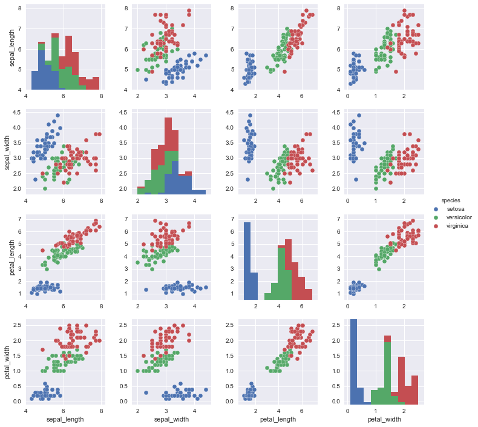

```python
# python data science handbook reading notes
import seaborn as sns
```


```python
iris = sns.load_dataset("iris")
iris.head()
```


<div>
<style>
    .dataframe thead tr:only-child th {
        text-align: right;
    }

    .dataframe thead th {
        text-align: left;
    }

    .dataframe tbody tr th {
        vertical-align: top;
    }
</style>
<table border="1" class="dataframe">
  <thead>
    <tr style="text-align: right;">
      <th></th>
      <th>sepal_length</th>
      <th>sepal_width</th>
      <th>petal_length</th>
      <th>petal_width</th>
      <th>species</th>
    </tr>
  </thead>
  <tbody>
    <tr>
      <th>0</th>
      <td>5.1</td>
      <td>3.5</td>
      <td>1.4</td>
      <td>0.2</td>
      <td>setosa</td>
    </tr>
    <tr>
      <th>1</th>
      <td>4.9</td>
      <td>3.0</td>
      <td>1.4</td>
      <td>0.2</td>
      <td>setosa</td>
    </tr>
    <tr>
      <th>2</th>
      <td>4.7</td>
      <td>3.2</td>
      <td>1.3</td>
      <td>0.2</td>
      <td>setosa</td>
    </tr>
    <tr>
      <th>3</th>
      <td>4.6</td>
      <td>3.1</td>
      <td>1.5</td>
      <td>0.2</td>
      <td>setosa</td>
    </tr>
    <tr>
      <th>4</th>
      <td>5.0</td>
      <td>3.6</td>
      <td>1.4</td>
      <td>0.2</td>
      <td>setosa</td>
    </tr>
  </tbody>
</table>
</div>


```python
iris['species'].head()
```


    0    setosa
    1    setosa
    2    setosa
    3    setosa
    4    setosa
    Name: species, dtype: object


```python
sns.set()
sns.pairplot(iris,hue="species")
```


    <seaborn.axisgrid.PairGrid at 0x1f226ab9748>





```python
X_iris = iris.drop('species',axis=1)
X_iris.shape
```


    (150, 4)


```python
from matplotlib import pyplot as plt
import numpy as np
```


```python
rng = np.random.RandomState(42)
x = 10 * rng.rand(50)
y=2*x -1 + rng.randn(50)
sns.set_style("whitegrid")
plt.scatter(x,y)
```


    <matplotlib.collections.PathCollection at 0x1f229748828>


**有监督学习: 简单线性回归**


```python
# 线性回归
from sklearn.linear_model import LinearRegression
```


```python
# 拟合截距 默认为true n_jobs是使用的任务数 -1是CPU核心数量
model = LinearRegression(fit_intercept=True,n_jobs=-1)
X = x.reshape(-1,1)
model.fit(X,y)
```


    LinearRegression(copy_X=True, fit_intercept=True, n_jobs=-1, normalize=False)


```python
model.coef_
```


    array([ 1.9776566])


```python
model.intercept_
```


    -0.90331072553111635


```python
# [-1,11] 平均生成100个数
xfit = np.linspace(-1,11,num=100)
```


```python
Xfit = xfit.reshape(-1,1)
yfit = model.predict(Xfit)
```


```python
plt.scatter(x,y)
plt.plot(xfit,yfit)
```


    [<matplotlib.lines.Line2D at 0x1f229b69d68>]


